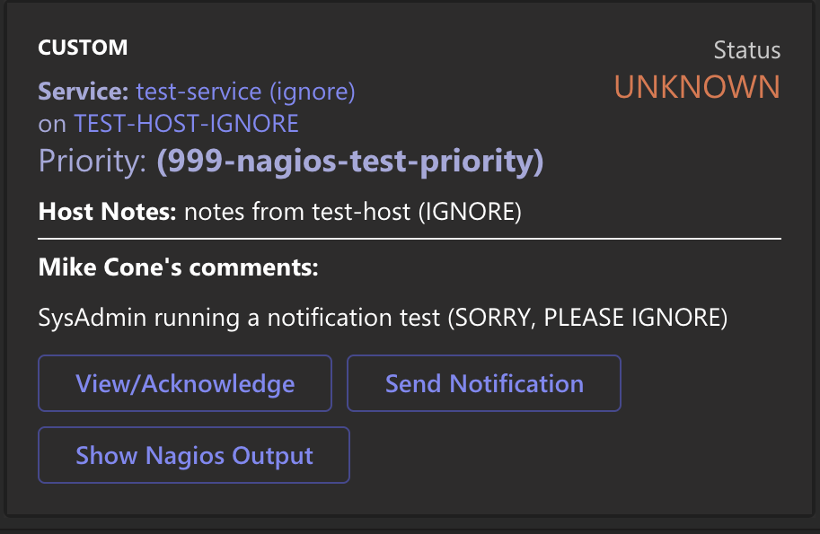

# Nagios MS-Teams notifications

Sends alerts to MS-Teams from Nagios.



I'm using Python with Jinja2 templates to send Simple messages and [Microsoft's "Adaptive Cards"](https://docs.microsoft.com/en-us/adaptive-cards/) to MS-Teams via an "Incoming Webhook".  This is not a bot, just a simple way for me to send nagios alerts.  For outages the fewer the moving parts of your alerting system the better.  Never depend on just one method of alerting.

## Requires:

* Your version of Nagios supports ["MACROS as Environment Variables"](https://assets.nagios.com/downloads/nagioscore/docs/nagioscore/3/en/macros.html) (see bottom of page).
* [Create an "incoming web-hook"](https://docs.microsoft.com/en-us/microsoftteams/platform/webhooks-and-connectors/how-to/add-incoming-webhook) for your MS-Teams Channel that will receive the alerts.
* Python3 on your Nagios host.

**NOTE:** I use a few custom MACROS that begin with '_' like '_HOSTRESTORE_PRIORITY'.  You may need to update the templates to match your setup.

## Install

```bash
# clone the repo
git clone https://github.com/mrmikee/nagios-notify-msteams.git

# install python requirements
pip3 install -r requirements.txt
```

## Config:

#### Edit notify-msteams.py 

```bash
# change to your Nagios URL:
NAGIOS_URL = "http://nagios.my.lan/cgi-bin/nagios3"
```

#### Edit Nagios --> contacts.cfg

Add the `_WEBHOOKURL` custom field and set it to your MS-Teams Incoming Webhook URL you created earlier.

```bash
define contact {
    contact_name                          msteams_contact
    alias                                 MSTeams
    host_notification_options             d,u,r
    service_notification_options          u,c,r
    email                                 noreply@noneya.com
    _WEBHOOKURL                           https://your-webhook-url-here/
    host_notification_period              24x7
    service_notification_period           24x7
    host_notification_commands            host-notify-ms-teams
    service_notification_commands         notify-ms-teams
}
```

#### Edit Nagios --> misccommands.cfg

```bash
define command {
    command_name  notify-ms-teams
    command_line  /your-path-to-commands/notify-msteams.py "SERVICE"
}

define command {
    command_name  host-notify-ms-teams
    command_line  /your-path-to-commands/notify-msteams.py "HOST"
}

# help debug config
/.../notify-msteams.py "HOST" --debug > /your-log-path/nag-teams-debug.log 2>&1
```

#### Files:

* `notify-msteams.py` is the main program
* `test.sh` is used to send data to the notify tool without Nagios.
* `templates/host.json.jinja` host notify template for MS-Adaptive Card format.
* `templates/service.json.jinja` service notify template for MS-Adaptive Card format.
* `templates/host_simple.json.jinja` host notify simple message template
* `templates/service_simple.json.jinja` service notify simple message template

#### Files used for debugging/development:

* `macros2json.py` was used to convert Nagios Macros to json sample data for the [Adaptive card designer](https://adaptivecards.io/designer/).
* `find_missing_var.py` gathered all the Jinja2 template vars that were used in the defined template file. Then added the vars to `test.sh`
